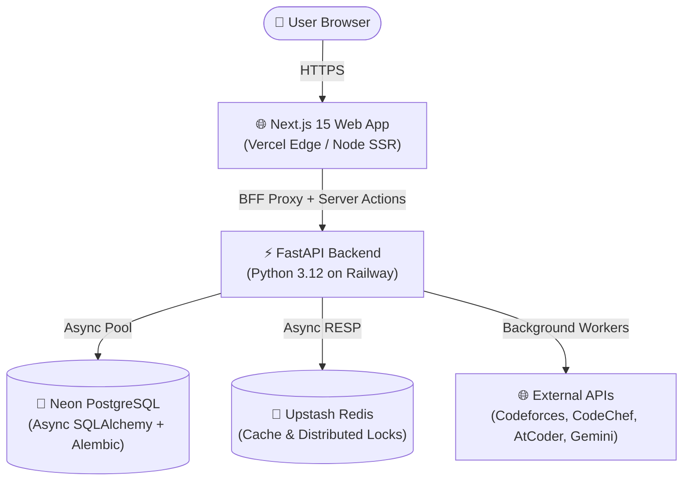

<div align="center">

# ⚡ NovaCP

### _The Operating System for Competitive Programmers_

[](https://github.com/ElectroBoy0/nova-cp/actions/workflows/ci.yml)
[](https://nextjs.org/)
[](https://fastapi.tiangolo.com/)
[](https://python.org)
[](https://www.typescriptlang.org/)
[](https://neon.tech/)
[](https://upstash.com/)
[](https://opensource.org/licenses/MIT)

**[🚀 Live Demo](https://nova-cp-web.vercel.app/)** • **[⚡ Backend Status](https://novacpweb-production.up.railway.app/health/detailed)** • **[📖 Documentation](docs/DEPLOYMENT.md)** • **[🐛 Report a Bug](https://github.com/ElectroBoy0/nova-cp/issues)**

</div>

---

## 💡 What is NovaCP?

Most competitive programmers practice by solving random problems or copy-pasting failed submissions into AI tools with huge spoilers. **NovaCP** is built to bridge the gap between practice and mastery: it analyzes your submissions, identifies the exact algorithmic blind spots holding you back, suggests non-spoiler progressive hints, and organizes your training workflow from end to end.

---

## ✨ Key Features

| Feature                                     | Description                                                                                                                                         |
| :------------------------------------------ | :-------------------------------------------------------------------------------------------------------------------------------------------------- |
| 🎯 **AI Diagnostics & Progressive Hints**   | Get 3-tiered hints (Algorithmic Concept $\rightarrow$ Key Invariant $\rightarrow$ Full Solution) powered by Gemini AI without spoiling the problem. |
| 📊 **Deep Performance Analytics**           | Interactive rating history graphs, submission heatmaps, tag mastery radars, and solve speed percentile distributions.                               |
| ⚔️ **Rivalry Comparison Engine**            | Head-to-head comparison with rivals: rating trajectories, shared solve diffs, speed breakdown, and weakness exploitation.                           |
| 📅 **Multi-Platform Contest Aggregator**    | Live contest schedule and countdown timers aggregated from Codeforces, CodeChef, and AtCoder with auto-refreshing background sync.                  |
| 🧩 **Smart Upsolve Queue**                  | Automatically finds the problems you _almost_ solved in past contests and prioritizes them in a structured practice queue.                          |
| 💻 **Integrated Code Execution Sandbox**    | Monaco-powered editor supporting C++, Python, and Java with custom test case execution and compilation diagnostics.                                 |
| ⚡ **Snippet Vault & Problem Notes**        | Save reusable templates (Segment Trees, DSU, FFT) and take rich Markdown notes linked directly to specific problems.                                |
| 🔒 **Cryptographic CF Handle Verification** | Verify ownership of your Codeforces handle through a secure one-time token mechanism without sharing credentials.                                   |

---

## 🏗️ Architecture & Monorepo Design



```
nova-cp/
├── apps/
│   ├── web/               # Next.js 15 (App Router, Tailwind CSS, Radix UI, Auth.js)
│   └── api/               # FastAPI (Python 3.12, asyncpg, SQLAlchemy 2.0, Alembic)
├── packages/
│   ├── types/             # Shared TypeScript schemas & API contracts
│   └── config/            # Shared ESLint, Prettier, & TypeScript configs
├── docs/                  # In-depth architectural & deployment guides
├── infra/                 # Docker Compose configurations
└── .github/               # CI/CD Workflows & Issue Templates
```

---

## 🚀 Quickstart & Local Development

### 1. Prerequisites

- **Node.js**: `≥ 20.0.0`
- **pnpm**: `≥ 9.0.0`
- **Python**: `≥ 3.12`
- **uv**: Astral's Python package manager (`curl -LsSf https://astral.sh/uv/install.sh | sh`)
- **Docker & Docker Compose**

### 2. Clone and Install

```bash
# Clone the repository
git clone https://github.com/ElectroBoy0/nova-cp.git
cd nova-cp

# Install JavaScript dependencies
pnpm install

# Install Python backend dependencies
cd apps/api
uv sync --all-extras
cd ../..
```

### 3. Configure Environment Variables

```bash
cp .env.example .env
```

_(Fill in `AUTH_SECRET`, `GOOGLE_CLIENT_ID`, `GOOGLE_CLIENT_SECRET`, and `DATABASE_URL` as outlined in `.env.example`)_

### 4. Start Infrastructure with Docker

```bash
docker compose up -d postgres redis
```

### 5. Run Database Migrations

```bash
cd apps/api
uv run alembic -c migrations/alembic.ini upgrade head
cd ../..
```

### 6. Start Development Servers

Run the frontend and backend development servers in separate terminals (or run the backend via Docker):

```bash
# Terminal 1 — Next.js Frontend:
pnpm dev

# Terminal 2 — FastAPI Backend (with hot-reload):
cd apps/api
uv run uvicorn app.main:app --reload --port 8000
```

- **Local Frontend**: [http://localhost:3000](http://localhost:3000)
- **Local Backend API**: [http://localhost:8000](http://localhost:8000)
- **Local API Docs (Swagger UI)**: [http://localhost:8000/docs](http://localhost:8000/docs)

> [!TIP]
> Looking for the live deployed app? Visit the production links at the top of the page:
>
> - **Production Web App**: [https://nova-cp-web.vercel.app/](https://nova-cp-web.vercel.app/)
> - **Production API**: [https://novacpweb-production.up.railway.app/](https://novacpweb-production.up.railway.app/)

---

## 🧪 Testing & Code Quality

NovaCP maintains strict test coverage and static analysis across both frontend and backend:

### Full Monorepo Checks

```bash
# Type check all TypeScript packages
pnpm type-check

# Lint all frontend components
pnpm lint

# Check formatting across all files
pnpm format:check
```

### Backend Python Suite

```bash
cd apps/api

# Run 91+ unit & integration tests with coverage
uv run pytest tests/ -v --cov=app

# Run Ruff linter and formatter
uv run ruff check .
uv run ruff format --check .
```

---

## 🌐 Production Deployment

NovaCP is architected for zero-maintenance managed cloud infrastructure:

- **Frontend**: [Vercel](https://vercel.com) — Global edge routing with Next.js 15 SSR.
- **Backend**: [Railway](https://railway.app) — Containerized FastAPI application with Uvicorn multi-workers.
- **Database**: [Neon](https://neon.tech) — Serverless PostgreSQL with connection pooling.
- **Cache**: [Upstash](https://upstash.com) — Serverless TLS Redis with distributed locks.

For full instructions, environment configurations, and OAuth callback setup, see **[DEPLOYMENT.md](docs/DEPLOYMENT.md)**.

---

## 🤝 Contributing

Contributions are welcome! Please read **[CONTRIBUTING.md](CONTRIBUTING.md)** for details on our code of conduct, development workflow, and submitting pull requests.

---

## 📄 License

This project is licensed under the MIT License - see the **[LICENSE](LICENSE)** file for details.

<div align="center">
  <sub>Built with ❤️ for competitive programmers worldwide.</sub>
</div>
