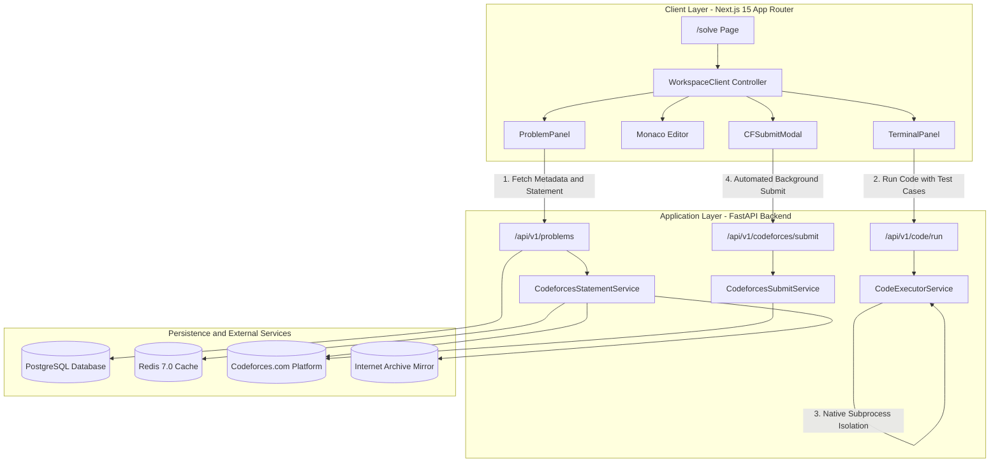

# NovaCP Solve Workspace — Complete Architectural Specification

This document provides a comprehensive, deep-dive breakdown of the **NovaCP Solve Workspace** architecture: how it is designed, how it operates end-to-end, and how each subsystem was engineered.

---

## Table of Contents
1. [Architecture Overview & Topology](#1-architecture-overview--topology)
2. [Frontend IDE & Client Orchestration](#2-frontend-ide--client-orchestration)
3. [Native Self-Hosted Execution Sandbox](#3-native-self-hosted-execution-sandbox)
4. [Statement Retrieval, Multi-Tier Caching & Asset Resilience](#4-statement-retrieval-multi-tier-caching--asset-resilience)
5. [Codeforces Direct Submission & Live Verdict Tracking](#5-codeforces-direct-submission--live-verdict-tracking)
6. [State Persistence & Zero Data Loss Design](#6-state-persistence--zero-data-loss-design)
7. [Security & Isolation Model](#7-security--isolation-model)

---

## 1. Architecture Overview & Topology

The Solve Workspace is a high-performance, three-tier competitive programming environment designed to eliminate third-party API latency and provide a desktop-grade IDE experience directly in the browser.



---

## 2. Frontend IDE & Client Orchestration

### Entry Point & Metadata Hydration
- **File:** `apps/web/app/(dashboard)/solve/page.tsx`
- The Next.js page retrieves the server-side authentication session (`auth()`) and reads query parameters (e.g. `?problemId=2026B` or UUID).
- Wrapped in a React `<Suspense>` boundary to ensure immediate rendering of skeletons while client-side state hydrates.

### Central Orchestrator (`WorkspaceClient`)
- **File:** `apps/web/components/workspace/workspace-client.tsx`
- Manages synchronized state across all panels:
  1. **Direct Fast Metadata Hook (`useProblem`)**: Fetches problem title, rating, tags, and runtime constraints directly from PostgreSQL in **<10ms**.
  2. **Split-Pane Drag & Drop Engine**: Allows fluid mouse-dragging dividers with width memory (`localStorage.getItem('novacp_workspace_left_width')`) and instant preset toggles (50/50, 65/35, and Focus Reading Mode).
  3. **Hotkeys**: Global listeners for `Cmd+Enter` (Run Code), `Escape` (Exit Focus Mode), `Cmd+K` (Problem Quick Search).

### Three-Pane Layout Structure
1. **Left: Problem Panel** (`components/workspace/problem-panel.tsx`)
   - Mathematical typography parsed with KaTeX via `MathText`.
   - Dynamic font size zoom controls (`A-`, `A+` from 12px to 24px).
   - Socratic algorithmic guidance toggles.
2. **Top-Right: Monaco Code Editor** (`components/workspace/monaco-code-editor.tsx`)
   - Full Monaco Editor setup with language switching (C++20, Python 3, Java 21).
   - Custom snippet integration (`useSnippets`) with keyword tab-completion.
3. **Bottom-Right: Terminal & Test Runner** (`components/workspace/terminal-panel.tsx`)
   - Custom test case manager: edit inputs, set expected outputs, add/delete test tabs.
   - Diff output console comparing `Expected Output` vs `Actual Output` with runtime execution metrics.

---

## 3. Native Self-Hosted Execution Sandbox

### Why We Didn't Need a 3rd-Party Web Service
Instead of subscribing to paid third-party APIs (like Judge0 or Piston), NovaCP runs a **native, multi-language sandbox** directly inside its Python/Linux environment.

- **File:** `apps/api/app/services/code_executor.py`

### Step-by-Step Execution Workflow

1. **Ephemeral Directory Isolation**:
   ```python
   with tempfile.TemporaryDirectory(prefix="cp_exec_") as temp_dir:
       work_dir = Path(temp_dir)
   ```
   Every code execution creates a unique, isolated directory in `/tmp` that is completely wiped on exit, ensuring zero disk pollution or cross-session leakage.

2. **Native Host Compilers**:
   The service auto-detects and binds to local system binaries:
   - **C++**: Compiles with production flags matching Codeforces judges:
     ```bash
     g++ -O3 -std=c++20 -DONLINE_JUDGE solution.cpp -o solution
     ```
   - **Java**: Compiles via `javac Main.java`.
   - **Python**: Invokes `python3 -u solution.py`.

3. **Asynchronous Pipe Streaming**:
   Uses `asyncio.create_subprocess_exec` to stream inputs and capture outputs without blocking the FastAPI event loop:
   ```python
   proc = await asyncio.create_subprocess_exec(
       *cmd,
       stdin=asyncio.subprocess.PIPE,
       stdout=asyncio.subprocess.PIPE,
       stderr=asyncio.subprocess.PIPE,
       cwd=str(work_dir),
   )
   stdout_bytes, stderr_bytes = await asyncio.wait_for(
       proc.communicate(input=input_bytes),
       timeout=time_limit_sec,
   )
   ```

4. **Resource Constraints & Safety Caps**:
   - **Time Limit Exceeded (TLE)**: Enforced via `asyncio.wait_for(..., timeout=time_limit)`. Any infinite loop triggers process termination (`SIGKILL`) within milliseconds.
   - **Memory Limits**: Java is constrained with `-Xmx256m -Xss32m`; C++ executes within container OS limits.
   - **Output Buffer Flooding**: Standard output and error streams are truncated at **64 KB** (`MAX_OUTPUT_BYTES = 64 * 1024`) to eliminate memory denial-of-service attempts.

5. **Hardware Timestamping & Diff Verification**:
   - Runtime is measured with sub-millisecond precision:
     ```python
     elapsed_ms = int((time.perf_counter() - start_time) * 1000)
     ```
   - Normalizes trailing whitespace and CRLF/LF line endings before diffing against expected outputs to assign verdicts (`ACCEPTED`, `WRONG_ANSWER`, `RUNTIME_ERROR`, `TIME_LIMIT_EXCEEDED`).

---

## 4. Statement Retrieval, Multi-Tier Caching & Asset Resilience

- **Files:** `apps/api/app/services/codeforces_statement.py`, `apps/web/components/ui/math-text.tsx`

### The Multi-Tier Fallback Hierarchy
When a problem statement is requested:
1. **Tier 1 (Database Metadata - <10ms)**: Problem name, limits, and tags load instantly from Postgres.
2. **Tier 2 (Redis Cache - <5ms)**: Checks Redis key `stmt:{contest_id}_{index}` (14-day TTL).
3. **Tier 3 (Direct Browser Impersonation Scrape)**: If uncached, requests the problem page using `curl_cffi` with a `chrome120` TLS fingerprint.
4. **Tier 4 (Internet Archive Wayback Mirror)**: If Cloudflare challenges the direct request (403), queries the Wayback Machine snapshot API (`archive.org/wayback/available?url=...`).
5. **Tier 5 (Background Async Worker)**: If scraping exceeds 4.5s, an immediate graceful algorithmic response is returned to keep the frontend responsive while an asynchronous worker finishes fetching and populates Redis.

### Image & Diagram Normalization (Cloudflare 403 Bypass)
Codeforces statement diagrams (e.g. `espresso.codeforces.com`) block cross-origin requests from external web apps with Cloudflare 403 Turnstile challenges.

- **Backend Normalization**:
  Rewrites direct `espresso.codeforces.com` image URLs to CORS-enabled HTTPS mirrors (`https://web.archive.org/web/2/{clean_url}`) and attaches `loading="lazy"` and `referrerpolicy="no-referrer"`.
- **Frontend Normalization**:
  In `math-text.tsx`, all statement HTML passes through a regex transformer that automatically upgrades insecure `http://` archive URLs to `https://` (preventing browser mixed-content blocks) and applies responsive styling (`max-w-full h-auto rounded-md border bg-white/95 p-1.5`) so diagrams are crisp in both dark and light modes.

---

## 5. Codeforces Direct Submission & Live Verdict Tracking

- **Files:** `apps/web/components/workspace/cf-submit-modal.tsx`, `apps/api/app/services/codeforces_submit.py`

### How Automated Submission Works
1. **Authentication Token Parsing**:
   The user configures their Codeforces session cookies (`JSESSIONID` and `39ce7` / `cf_clearance`) in Settings or directly in the modal.
2. **CSRF Extraction**:
   The backend visits `https://codeforces.com/contest/{contest_id}/submit` with the user's cookies, parses the DOM, and extracts the dynamic `csrf_token`.
3. **Anti-Duplicate Code Bypass**:
   Codeforces blocks identical duplicate submissions within a short window. If Codeforces returns *"You have submitted exactly the same code before"*, NovaCP automatically appends a subtle comment with a cryptographic nonce:
   ```cpp
   // [NovaCP 1787684071_842]
   ```
   and immediately resubmits, resulting in a seamless submission experience.
4. **Real-Time Polling Engine**:
   The client polls Codeforces' official user status API (`https://codeforces.com/api/user.status?handle=...`) every 1.5 seconds, tracking the submission from `In Queue` → `Testing on test X` → `Accepted` / `Wrong Answer` with sound effects and solve session logging.

---

## 6. State Persistence & Zero Data Loss Design

To ensure users never lose code during long contests or unexpected network disconnects:
- **Code Drafts**: Saved to `localStorage` under `novacp_workspace_code_{problemId}_{lang}`.
- **Solve Timer State**: Preserved in `localStorage` under `novacp_timer_{problemId}`, saving elapsed seconds, mode (stopwatch vs countdown), and start timestamps.
- **Solve History**: On successful solve or submission, metrics are recorded into `novacp_solve_history` (duration, language, problem ID, status).

---

## 7. Security & Isolation Model

1. **Subprocess Isolation**: User code runs inside short-lived non-root subprocesses with restricted working directories.
2. **Ephemeral Lifecycles**: All binaries and object files are deleted immediately after test case execution.
3. **Buffer Clamping**: Standard output buffers are hard-capped at 64KB to prevent memory exhaustion attacks.
4. **Strict CPU Timeouts**: Wall-clock execution timeouts (default 2.0s) strictly prevent hanging worker processes.
